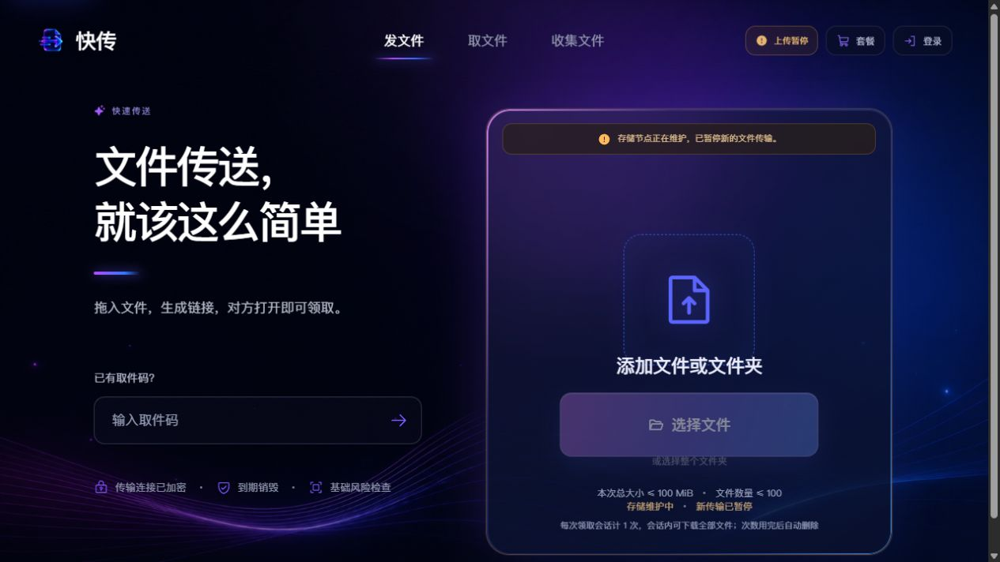
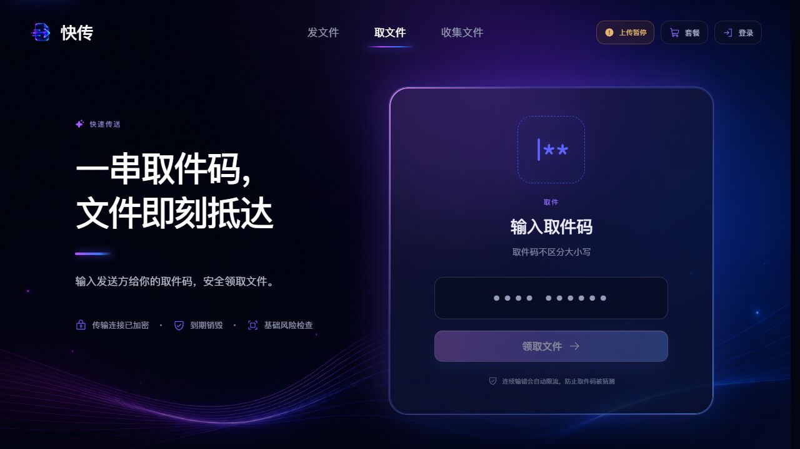
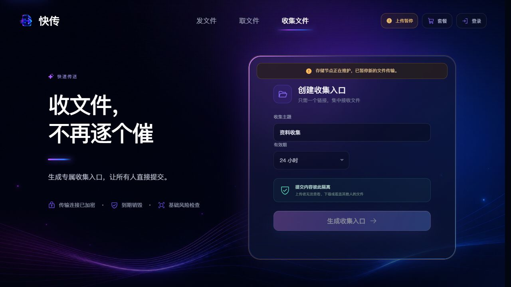

# QuickTransfer

[简体中文](README.md) | [English](README_EN.md)

QuickTransfer is a full-stack file transfer system designed for temporary file delivery. It supports file sending, pickup-code retrieval, file collection, account entitlements, upload traffic management, and administrator settings while keeping the control plane and storage plane separated.

## Interface Preview

### Send Files



### Retrieve Files



### Collect Files



## Features

- Transfer individual files, multiple files, or folders
- Share files through access links, QR codes, and 10-character pickup codes
- Resume uploads, serve HTTP Range downloads, and limit retrieval sessions
- Support guests, registered users, and multiple VIP tiers
- Manage permanent upload traffic, daily check-ins, and redemption codes
- Create collection tasks with submitter data isolation
- Isolate chunks, inspect content, publish atomically, and clean up automatically
- Provide administrator configuration, user operations, auditing, and external-service status management

## Architecture

```text
Browser
  |-- Pages, identity, tasks, and entitlements --> Control plane
  `-- File chunks and download bytes ----------> Storage plane
                                                    |
                                                    `-- Signed status callback --> Control plane
```

The control plane manages pages, identity, task metadata, entitlements, orders, audits, and short-lived capability tokens. The storage plane manages chunks, isolation, content inspection, object publication, Range downloads, and physical disk safeguards. File payloads do not pass through the control plane.

## Account Policies

| Account type | Total size per transfer | File count | Available retention |
| --- | ---: | ---: | --- |
| Guest | 100 MiB | Up to 100 | 1, 12, or 24 hours |
| Registered user | 2 GiB | Up to 100 | 1, 12, 24, or 72 hours |
| Monthly/annual VIP | 10 GiB | Up to 1,000 | 1, 12, 24, or 72 hours |
| Lifetime VIP | 50 GiB | Up to 10,000 | 1, 12, 24, or 72 hours |

Total bytes and file count are independent limits. Account resources track remaining upload traffic only; downloads do not consume traffic.

## Technology

- React 19
- Vite 6
- Go 1.25+
- SQLite WAL
- Node.js 20+

## Source Layout

| Path | Contents |
| --- | --- |
| `src/` | React pages, components, and browser API clients |
| `public/` | Icons, fonts, and static assets |
| `internal/app/` | Business state machines and control/storage plane implementations |
| `cmd/` | Executable entry points and administration tools |
| `docs/` | Product, architecture, and security documentation |

Runtime data, databases, logs, keys, certificates, build outputs, and environment configuration are not source code and must not be committed to the repository.

## Build

Install frontend dependencies:

```bash
npm ci
```

Start the frontend development server:

```bash
npm run dev
```

Build the frontend:

```bash
npm run build
```

Build all Go programs:

```bash
npm run build:binaries
```

Build every component:

```bash
npm run build:all
```

## Configuration Principles

- Supply runtime configuration through `QT_*` environment variables or protected external configuration.
- Never store passwords, session secrets, email credentials, payment keys, or storage shared secrets in source code.
- Enable external email, CAPTCHA, content inspection, and payment capabilities only after configuration is complete and runtime checks pass.
- Keep unconfigured external services explicitly unavailable.

## Security Boundaries

- Passwords use strong hashing, sessions use HttpOnly cookies, and state-changing requests require CSRF validation.
- Uploads and downloads use short-lived, narrowly scoped capability tokens.
- Control-plane and storage-plane callbacks use HMAC, timestamps, and replay protection.
- Uploaded files are published only after isolation and content inspection.
- Traffic reservation, settlement, retrieval counts, and redemption operations are protected by transactions and unique constraints.
- Logs and browser responses must never contain passwords, cookies, verification codes, secrets, or complete redemption codes.

## Documentation

- [Product and Architecture](docs/PRODUCT_AND_ARCHITECTURE.md)
- [Security Design](docs/SECURITY.md)
- [Font Assets](docs/FONTS.md)

## Archived State

This repository retains only buildable product source code, required static assets, and durable documentation. Tests, runtime data, environment configuration, certificates, keys, logs, deployment materials, dependency directories, and build outputs are excluded from the archived source tree.
